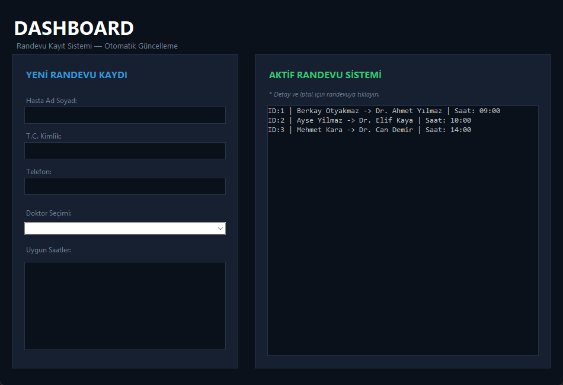

# Doktor Randevu Sistemi

Hasta kayitlari, doktor secimi ve randevu islemlerinin yonetildigi masaustu uygulamasidir. Tkinter ile koyu temali, mavi accentli modern bir arayuz sunar.

## Teknolojiler

- **Python 3** - Programlama dili
- **Tkinter** - Masaustu GUI framework

## Proje Yapisi

    DoktorRandevuSistemi/
    ├── DoktorRandevu.py             # Frontend - Ana arayuz
    ├── DoktorRandevu_Backend.py     # Backend - Veri modelleri ve is mantigi
    ├── images/                      # Ekran goruntuleri
    └── README.md

## Ana Siniflar

### Hasta (`DoktorRandevu_Backend.py`)

- **Ozellikler:** `hasta_id`, `ad`, `tc`, `telefon`
- **Aciklama:** Sisteme kayit olacak hastalarin temel bilgilerini tutar

### Doktor (`DoktorRandevu_Backend.py`)

- **Ozellikler:** `doktor_id`, `ad`, `uzmanlik`, `uygun_saatler`
- **Metodlar:** `uygunluk_kontrol(saat)` - saat musaitlik kontrolu, `randevu_saatini_kullan(saat)` - saati rezerve etme, `saati_iade_et(saat)` - iptal edilen saati geri ekleme

### Randevu (`DoktorRandevu_Backend.py`)

- **Ozellikler:** `randevu_id` (otomatik artan), `tarih`, `saat`, `doktor`, `hasta`
- **Metodlar:** `randevu_bilgi()` - randevu ozetini metin olarak doner

### ModernRandevuApp (`DoktorRandevu.py`)

- **Ozellikler:** Renk paleti, doktor listesi, randevu listesi, hasta sayaci
- **Metodlar:** `arayuz_olustur()`, `saatleri_guncelle()`, `randevu_olustur()`, `liste_guncelle()`, `randevu_detay_penceresi()`, `randevu_iptal_et()`

## Ozellikler

- **Randevu Kaydi:** Hasta bilgileri, doktor secimi ve uygun saat secilerek yeni randevu olusturma
- **Doktor Yonetimi:** 5 farkli uzmanlik alaninda doktor ve otomatik saat yonetimi
- **Aktif Randevular:** Tum randevularin anlık listelenmesi ve detay goruntuleme
- **Randevu Iptali:** Cift tiklayarak detay penceresi acma ve randevu iptal etme, iptal edilen saatin otomatik iade edilmesi
- **Tasarim:** Koyu tema (#0b111b arkaplan) + mavi accent (#3498db) + modern tipografi

## Ekran Goruntuleri

### Ana Ekran

## Kurulum ve Calistirma

    python DoktorRandevu.py

## Varsayilan Doktorlar

- **Dr. Ahmet Yilmaz** - Kardiyoloji
- **Dr. Elif Kaya** - Goz Hastaliklari
- **Dr. Can Demir** - Dahiliye
- **Dr. Yaren Taskala** - Kalp ve Damar Cerrahisi
- **Dr. Lujayen Ajahar** - Beyin Cerrahisi
